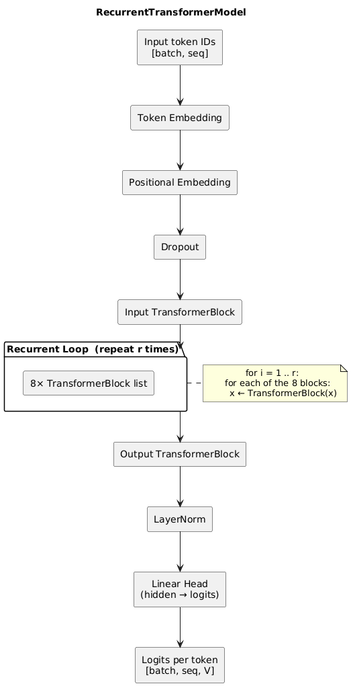
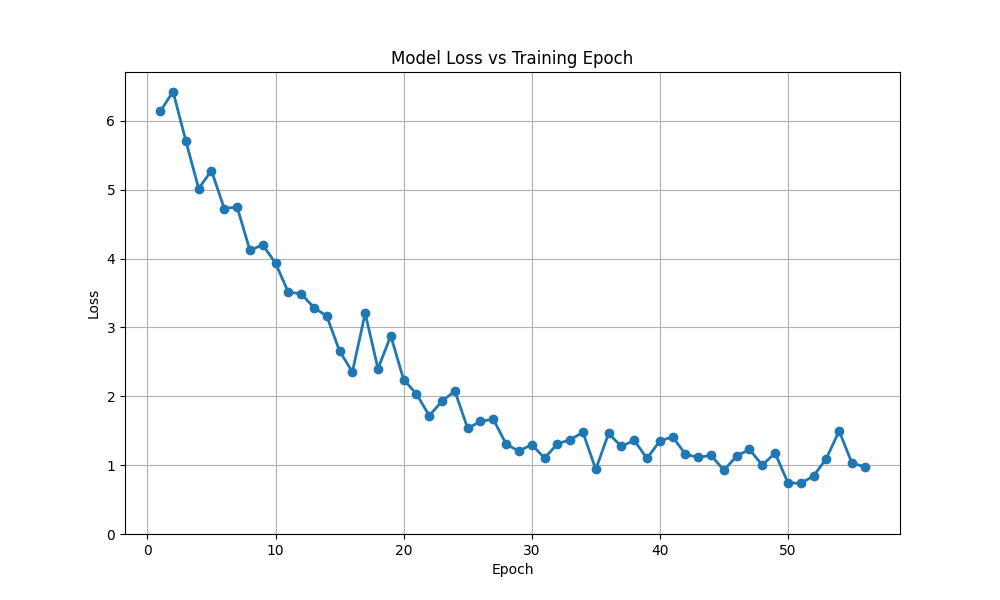
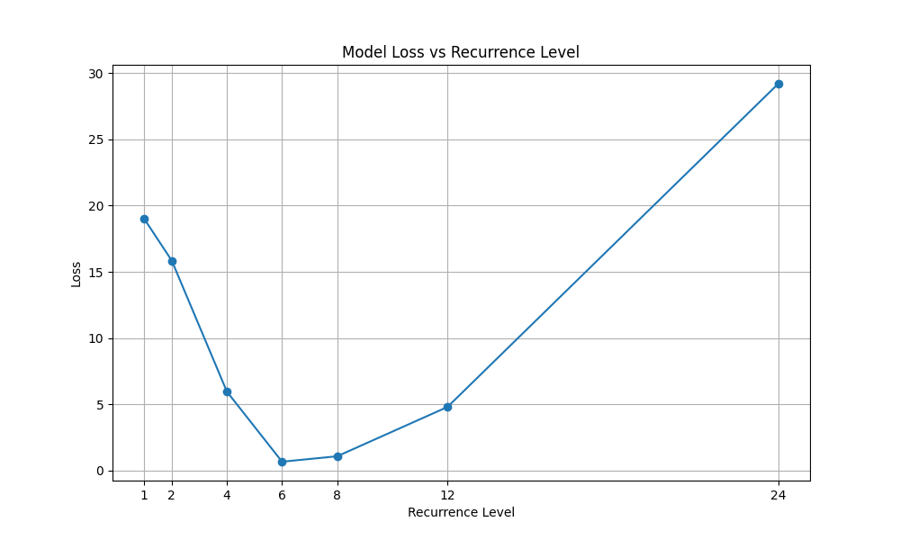

\pagebreak

\tableofcontents

\listoffigures

\pagebreak

# Introduction

## Motivation

Two mainstream routes for improving reasoning in language models are

1. Scaling the network by adding more layers or wider matrices.
2. Embedding chain-of-thought (CoT) prompts so the model spells out each intermediate step.

Both approaches increase runtime demands: parameters grow quadratically with width, and CoT inflates the prompt length linearly with reasoning depth.

A lighter alternative is to keep parameters and prompt length fixed while giving the model more time looping over its own hidden state. This idea was explored in _[Scaling up Test-Time Compute with Latent Reasoning](https://arxiv.org/abs/2502.05171)_ [@geiping2025scalingtesttimecomputelatent], where the authors showed that latent reasoning can be more effective than token-level recurrence (i.e. CoT) in large models. This project explores that idea and tries to replicate their findings in a resource-constrained setting (single consumer GPU, <100 M parameters).

We asked the following questions:

- Can hidden state recurrence improve a compact model?
- How does latent recurrence compare with a token-level loop under identical training recipes?

We replicate both variants from scratch and analyze loss curves and qualitative behaviour.

# Methodology

## Architecture Overview

{ width=50% }

ModularTextModel (see `model.py`) is built from three stacked modules:

1. Embedding & Input projection: token indices → hidden size h = 360 via nn. Embedding followed by Linear+GELU.
2. Transformer Core: 4 layers, 12-head attention, feed-forward multiplier 4; this block can be repeated.
3. Output layer: Linear map to vocabulary logits; only the last token's logits are returned.

Parameter count is ~28M, verified with `random_utils.py` count params.

## Recurrence in Practice

The core loop is controlled by the argument `num_recurrences`. During evaluation we sweep $r \in {1, 2, 4, 6, 8, 12, 24}$ to study depth-loss trade-offs. No token-level replay or early-exit logic is implemented in the current codebase.

## Training Configuration

- Dataset: Hugging Face `nampdn-ai/tiny-strange-textbooks` [@nam_pham_2024] (16GB of raw text), streamed line-by-line.
- Sequence length: 64 tokens produced with a sliding, left-padded window.
- Optimizer: AdamW, learning-rate $1 \times 10^{-3}$, batch 32.
- Epochs: default 3 (override with -e flag); one checkpoint per epoch in `./checkpoints/`.

## Evaluation Pipeline

- `main.py train`: launches training and saves checkpoints.
- `main.py manual`: interactive generation from a custom prompt.
- `main.py evaluate`: computes loss at each recurrence depth and writes CSV + plot to
  `./evaluation/`.
- `random_utils.py`: helper for plotting training-loss and recurrence-loss.

Example commands:

```bash
# fresh training run (3 epochs, batch 32)
python src/main.py train -e 3 -b 32

# interactive generation using the latest checkpoint
python src/main.py manual

# sweep loss over recurrence depths
python src/main.py evaluate -r 1 2 4 6 8 12 24
```

# Results

## Training Dynamics

Figure \ref{fig:training_loss} traces the negative-log-likelihood over 55 epochs. Loss falls from roughly 6.3 to 1.0 without signs of over-fitting, confirming that streaming the dataset and saving checkpoints every epoch is sufficient for stable convergence.



## Effect of Recurrence Depth

After training the model at a recurrence depth of 6, we evaluated this checkpoint at seven other recurrence depths $r \in {1, 2, 4, 6, 8, 12, 24}$. Average cross-entropy on 500 held-out samples is visualized in Figure \ref{fig:recurrence_loss} and summarized numerically in the table below.



| Recurrence r | Average Loss |
| ------------ | ------------ |
| 1            | 19.1         |
| 2            | 15.8         |
| 4            | 6.1          |
| 6            | 0.6          |
| 8            | 0.9          |
| 12           | 4.8          |
| 24           | 29.4         |

Table: Cross-entropy loss at different recurrence depths (latent-recurrence model).

### Observations

- Loss decreases steeply up to r = 6 where it reaches a minimum of 0.6. This makes sense as the model was trained at a recurrence depth of 6. This shows that latent recurrence has a significant impact on model performance.
- Beyond r = 8 the benefit reverses; at r = 24 loss is higher than the single-pass baseline, showing how sensitive the model is to its training recurrence depth.
- With the current implementation, the sweet-spot for compute-to-quality trade-off lies in the range r = 4-6.

# Discussion and Future Work

## Lessons Learned

1. Streaming the dataset avoided GPU idling and removed the need to pre-shuffle the corpus, which is helpful when storage or RAM is limited.
2. Qualitatively, the model was not big enough to produce intelligible text. The output was often gibberish, although noticeably less so as we made the model deeper. This is likely due to the limited size of the training set and the model itself.
3. Depth matters. Performance improved by two orders of magnitude between r = 1 and r = 6, then deteriorated for deeper loops. Identifying that sweet-spot is therefore crucial for efficient deployment.
4. Lightweight implementation. Re-using the same 28M parameter core allowed us to explore depth sweeps without retraining or touching the checkpoint, making experimentation rapid.

## Future Directions

- Token-recurrence baseline. Train and benchmark the model at separate recurrence levels proposed in the project plan to quantify gains attributable to latent versus surface recurrence.
- Better benchmark. Train using reinforcement learning to better benchmark the performance instead of just loss on the full corpus to measure whether the optimal depth shifts.
- Distillation. Investigate whether a shallow student (e.g. r = 2) can learn to approximate the behaviour of the deeper teacher.

\clearpage

# References

::: refs

:::
